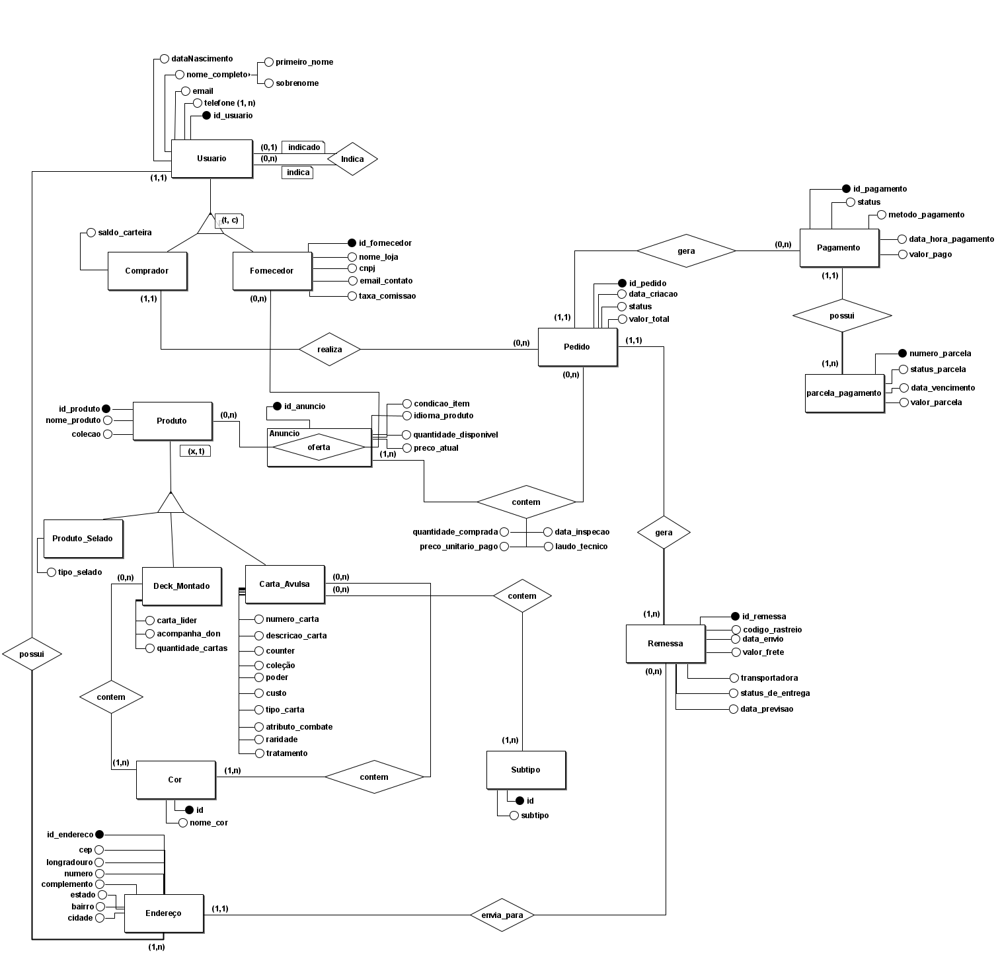
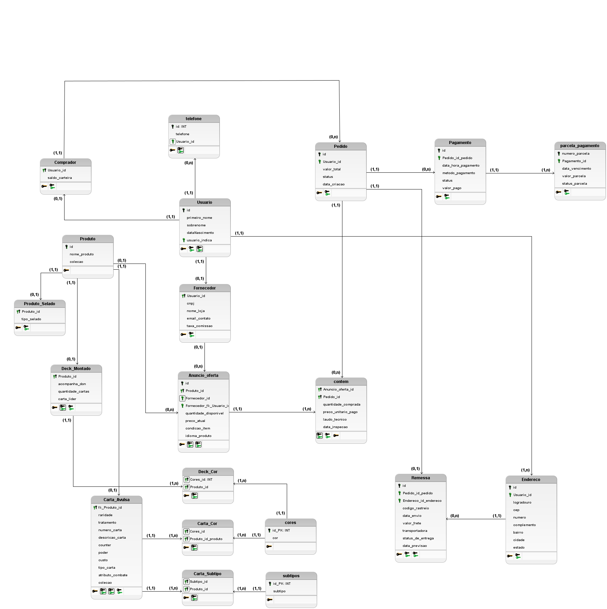

# TCGHub

O **TCGHub** é uma plataforma de marketplace voltada ao universo de **Trading Card Games (TCG)**, desenvolvida com o objetivo de centralizar anúncios de cartas colecionáveis em um único ambiente digital.

A proposta do sistema é permitir que diferentes vendedores disponibilizem seus produtos em uma mesma plataforma, enquanto compradores podem comparar ofertas, verificar disponibilidade e escolher a melhor opção de compra sem precisar navegar por múltiplos sites.

Este projeto foi desenvolvido no contexto da disciplina de **Banco de Dados** da **CESAR School**, ministrada pela professora **Natacha Targino**.

---

## Sumário

- [Visão Geral](#visão-geral)
- [Banco de Dados](#banco-de-dados)
- [Instruções de Uso](#instruções-de-uso)
  - [Como rodar o backend e o banco de dados](#como-rodar-o-backend-e-o-banco-de-dados)
  - [Configuração de Objetos do Banco de Dados (Views, Funções, etc)](#configuração-de-objetos-do-banco-de-dados-views-funções-etc)
  - [Autenticação e proteção de rotas](#autenticação-e-proteção-de-rotas)
  - [Documentação da API](#documentação-da-api)
  - [Como preparar o front-end](#como-preparar-o-front-end)
- [Equipe](#equipe)

---

## Visão Geral

O sistema foi projetado para atender às principais necessidades de um marketplace de cartas colecionáveis, reunindo em uma única aplicação funcionalidades relacionadas a cadastro, autenticação, consulta e gerenciamento de ofertas.

### Objetivos da plataforma

- Centralizar anúncios de cartas de TCG em um único ambiente
- Facilitar a comparação de preços entre diferentes vendedores
- Organizar informações de produtos e ofertas de forma estruturada
- Disponibilizar uma base sólida para integração entre back-end, banco de dados e front-end

---

## Banco de Dados

### Modelagem Conceitual

<div align="center">
  
</div>

### Modelagem Lógica

<div align="center">
  
</div>

### Esquema Relacional

🔗 [Documento Esquema Relacional - TCGHub](https://docs.google.com/document/d/1me9ABYs-yamXbWwz0Uigysa_Rj87qARYEbEB8NiINfI/edit?usp=sharing)

---

## Instruções de Uso

## Como rodar o backend e o banco de dados

O projeto pode ser executado com **Docker**, permitindo subir o back-end em **Spring Boot** e o banco de dados **MySQL** de forma integrada.

### Pré-requisitos

Antes de iniciar, verifique se os seguintes itens estão instalados em sua máquina:

- Docker
- Docker Compose
- Git

### Execução do projeto

Na raiz do back-end, execute o comando abaixo:

```bash
docker compose up --build

```

Esse processo irá:

* construir as imagens necessárias
* subir o container do banco de dados MySQL
* subir o container da aplicação back-end
* expor o back-end na porta `8080`
* expor o banco MySQL na porta `3307`

### Endereços de acesso

Após a inicialização dos containers, os seguintes serviços estarão disponíveis:

* **Back-end:** `http://localhost:8080`
* **Documentação da API (Swagger):** `http://localhost:8080/swagger-ui.html`
* **MySQL:** `localhost:3307`

### Como parar a execução

Para interromper os containers sem removê-los:

```bash
docker compose stop

```

Para interromper e remover os containers:

```bash
docker compose down

```

### Quando utilizar `docker compose down -v`

Esse comando é indicado quando for necessário recriar completamente o ambiente do banco, especialmente em situações como:

* alteração no arquivo `schema.sql`
* alteração no arquivo `data.sql`
* reinicialização completa da base de dados

Após a remoção dos volumes, utilize novamente:

```bash
docker compose up --build

```

---

## Configuração de Objetos do Banco de Dados (Views, Funções, etc)

Após o banco de dados estar rodando, é necessário executar manualmente os scripts SQL que contêm a lógica de negócio avançada (Etapas 04 e 05).

### 1. Habilitar criação de funções/triggers

Para evitar erros de permissão ao criar funções no MySQL via Docker, execute:

```bash
docker exec -it tcghub-mysql sh -c 'mysql -uroot -p"$MYSQL_ROOT_PASSWORD"' -e "SET GLOBAL log_bin_trust_function_creators = 1;"

```

### 2. Importar Views, Funções, Procedures e Triggers

Execute os comandos abaixo na ordem para carregar os arquivos SQL localizados em `src/main/resources/docs/`:

**Views:**

```bash
docker exec -i tcghub-mysql sh -c 'mysql -uroot -p"$MYSQL_ROOT_PASSWORD" "$MYSQL_DATABASE"' < src/main/resources/docs/etapa04_views.sql

```

**Funções:**
- Antes, garante que o MySQL permite criar funções:

```bash
docker exec -it tcghub-mysql sh -c 'mysql -uroot -p"$MYSQL_ROOT_PASSWORD"'

```

- Entrar no mysql e executar
```bash
SET GLOBAL log_bin_trust_function_creators = 1;
```

- Sair do MySQL e executar
```bash
docker exec -i tcghub-mysql sh -c 'mysql -uroot -p"$MYSQL_ROOT_PASSWORD" "$MYSQL_DATABASE"' < src/main/resources/docs/etapa05_funcoes.sql
```
**Procedimentos:**

```bash
docker exec -i tcghub-mysql sh -c 'mysql -uroot -p"$MYSQL_ROOT_PASSWORD" "$MYSQL_DATABASE"' < src/main/resources/docs/etapa05_procedimentos.sql

```

**Triggers:**

```bash
docker exec -i tcghub-mysql sh -c 'mysql -uroot -p"$MYSQL_ROOT_PASSWORD" "$MYSQL_DATABASE"' < src/main/resources/docs/etapa05_triggers.sql

```

---

## Autenticação e proteção de rotas

A API utiliza autenticação baseada em **JWT (JSON Web Token)**.

Isso significa que parte dos endpoints está disponível publicamente, enquanto as demais rotas exigem um token JWT válido enviado no cabeçalho da requisição.

### Rotas públicas

As rotas abaixo podem ser acessadas sem autenticação:

* `/auth/register`
* `/auth/login`
* `/auth/refresh`
* `/auth/logout`
* `/h2-console/`
* `/swagger-ui.html`
* `/swagger-ui/`
* `/v3/api-docs`
* `/v3/api-docs/`

---

## Documentação da API

A aplicação disponibiliza documentação interativa da API por meio do **Swagger**.

Para consultar os endpoints disponíveis, seus parâmetros, respostas e testar requisições diretamente pelo navegador, acesse:

```text
http://localhost:8080/swagger-ui.html

```

---

## Como preparar o front-end

Para execução do front-end localmente, siga os passos abaixo.

### 1. Instalar o Node.js (versão LTS)

Download: https://nodejs.org/en/download

### 2. Verificar a instalação

```bash
node -v
npm -v

```

### 3. Instalar o pnpm

```bash
npm install -g pnpm

```

### 4. Instalar as dependências do front-end

```bash
cd frontend
pnpm install

```

### 5. Executar o front-end

```bash
pnpm dev

```

---

## Equipe

### Desenvolvedores

* [Amanda Luz](https://github.com/amandaaluzc) — alc2@cesar.school
* [Lucas Menezes](https://github.com/Lucasmenezes08) — lms4@cesar.school
* [Ricardo Sérgio Freitas](https://github.com/whosricardo) — rspff@cesar.school
* [Thiago Fernandes](https://github.com/ThIagoMedeiros21) — tfm3@cesar.school

### Orientadora

* Natacha Targino

```

```